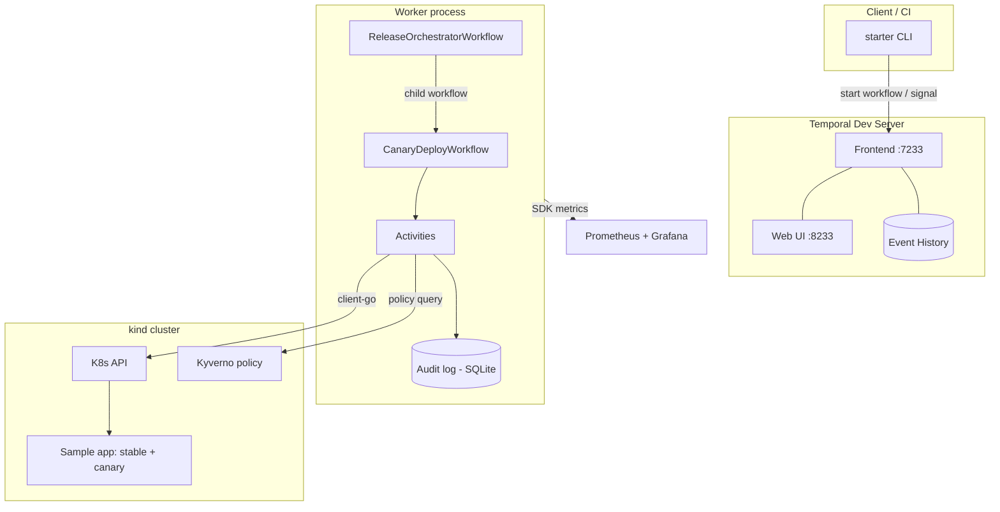

# Architecture

TemporalOps is a self-healing deploy/rollback orchestrator for Kubernetes built
on [Temporal](https://temporal.io). It models a progressive canary release as a
durable workflow with explicit, hand-written saga compensation, a human approval
gate, and an append-only audit trail. The point of the project is durability
under failure: the orchestration survives worker crashes, API timeouts, and
missing approvals without losing state or producing duplicate side effects.

## Why Temporal

A canary deploy is a long-running, multi-step process with external side effects
(scaling pods, shifting traffic) that must be undone in reverse order when a
later step fails. Doing this with cron jobs or a controller reconcile loop means
hand-rolling state persistence, retries, timeouts, and idempotency. Temporal
provides those as primitives: workflow state is persisted as an event history
and replayed on recovery, so a worker can die mid-deploy and resume from the
exact last completed step on restart.

## Components



## CanaryDeployWorkflow

Input: service name, image tag, target replica count, bake duration.

Happy-path sequence:

1. **PolicyCheckActivity** — confirm the image is signed/scanned via Kyverno.
   Failure here aborts the workflow immediately with no compensation, because
   nothing has been changed yet.
2. **ScaleCanaryActivity** — deploy canary replica(s) of the new image.
3. **HealthCheckActivity** — poll canary pods and a synthetic health endpoint
   for the bake duration; return pass/fail plus metrics.
4. **ShiftTrafficActivity** — progressively move traffic weight from stable to
   canary (replica-ratio model: both Deployments sit behind one Service, so the
   traffic split approximates the replica-count ratio).
5. **Human approval gate** — wait on an `approve-promote` signal. If it does not
   arrive within the configured timeout, auto-rollback and finish as `TimedOut`
   rather than hanging.
6. **PromoteActivity** — scale the new version to the target replica count and
   retire the old one.

### Saga compensation

Compensation is a hand-built stack, not a library, so the rollback logic is
explicit and reviewable. Each successful side-effecting activity pushes its
inverse onto the stack:

| Forward activity | Compensation |
|------------------|--------------|
| ScaleCanaryActivity | ScaleDownCanaryActivity |
| ShiftTrafficActivity | ShiftTrafficBackActivity |
| (any failure path) | AlertActivity |

On failure of `HealthCheckActivity`, `ShiftTrafficActivity`, or approval
timeout, the stack is unwound in LIFO order: traffic shifts back before the
canary scales down, mirroring real rollback ordering.

### Retry policies

Each activity carries an explicit `RetryPolicy`. Network-bound activities
(policy check, K8s scale, traffic shift) get bounded exponential backoff so a
transient API blip self-heals; the health check uses a longer window because it
is intentionally polling over the bake duration. Rationale for each choice is
commented inline at the call site — these double as interview talking points.

## ReleaseOrchestratorWorkflow

For multi-service releases, the orchestrator spawns one `CanaryDeployWorkflow`
child per service (fan-out), waits for all of them (fan-in), and aggregates the
results. A partial failure is never swallowed: the orchestrator reports which
services promoted and which rolled back.

## Audit trail

Every activity start, end, and result is appended to a SQLite table tagged with
workflow ID, run ID, timestamp, and actor (the signal sender for approvals).
SQLite makes the "compliance artifact" queryable with plain SQL. Writes are
idempotent on `(workflow_id, run_id, activity_id, phase)` so replay after a
crash does not duplicate rows.

## Durability and idempotency

Activities are written to be idempotent — re-running a scale or traffic-shift
converges to the same desired state rather than stacking effects — so Temporal's
at-least-once activity execution is safe. The chaos scripts (Stage 7) kill the
worker mid-activity, time out the K8s and Kyverno calls, and withhold the
approval signal, and the Web UI history shows the workflow resuming correctly.

## Observability

The worker exposes Temporal SDK metrics on a Prometheus endpoint. A provided
Grafana dashboard (importable JSON) shows workflow start/complete/fail counts,
active workflows, and activity retry counts. The Temporal Web UI on `:8233` is
used during demos to walk through workflow history visually.

## Repository layout

```
cmd/        worker, starter, chaos binaries
internal/   workflows, activities, audit, config (non-importable impl)
deploy/     docker-compose, k8s manifests, kyverno policy, observability config
scripts/    cluster setup, demo, chaos scripts
```

Workflow code is kept strictly separate from activity code because Temporal
requires workflow functions to be deterministic (no clocks, no I/O, no
randomness); all of that lives in activities.
