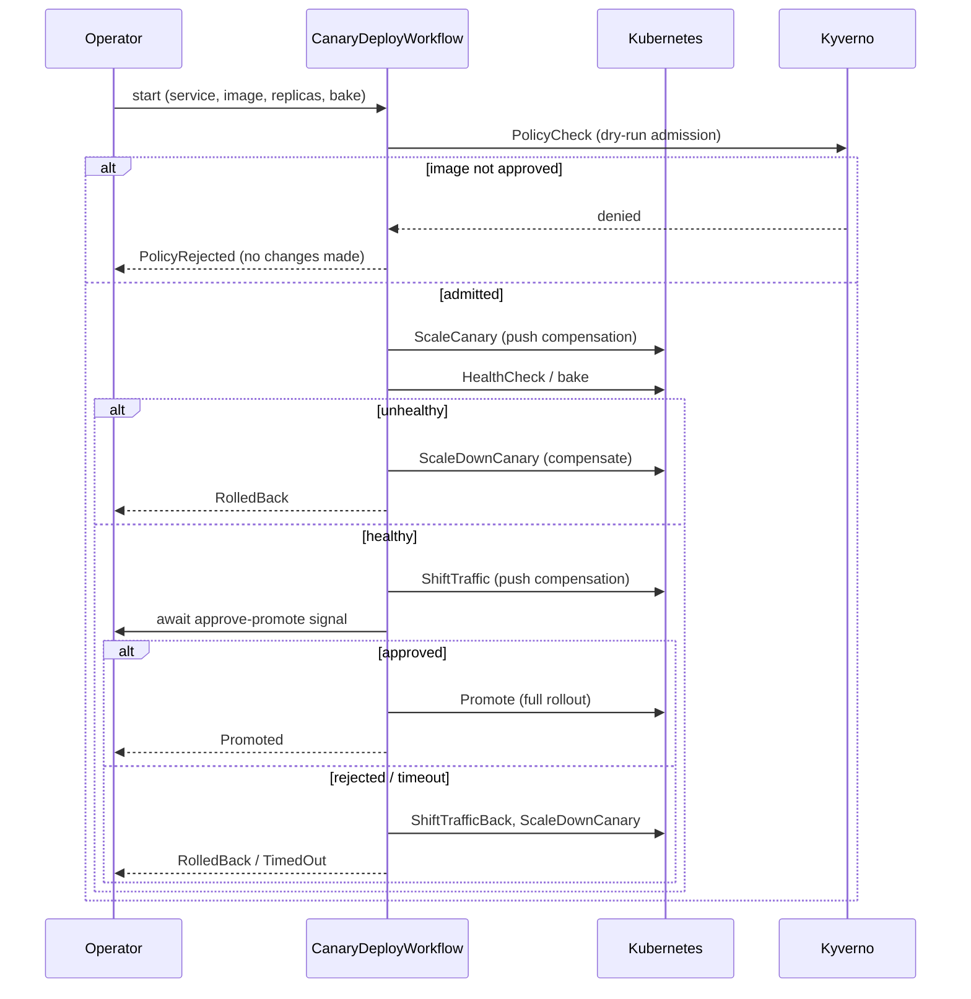

# TemporalOps

A self-healing Kubernetes deploy/rollback orchestrator built on
[Temporal](https://temporal.io). It runs a progressive canary release as a
durable workflow: policy check, canary scale-up, health bake, traffic shift,
human approval gate, and full promotion — with hand-written saga compensation
that rolls the change back in reverse order when any step fails or approval
times out.

The goal of the project is to demonstrate fault-tolerant orchestration: the
workflow survives worker crashes, K8s/Kyverno API timeouts, and missing
approvals without losing state or duplicating side effects, and every step is
recorded to a queryable audit log.

See [ARCHITECTURE.md](ARCHITECTURE.md) for the design and rationale.

## What it does

- Runs a progressive canary release as a durable Temporal workflow against a
  real Kubernetes cluster (`client-go`), using a replica-ratio traffic model.
- Gates every deploy on a Kyverno image policy before anything changes.
- Rolls back automatically with a hand-written saga (LIFO compensation) on
  health failure, traffic-shift failure, rejection, or approval timeout.
- Pauses at a human approval gate (`approve-promote` signal) and auto-rolls-back
  if no decision arrives within a configurable window — it never hangs.
- Fans out multi-service releases as child workflows and surfaces per-service
  outcomes without swallowing partial failures.
- Records every activity and approval to an append-only, queryable SQLite audit
  log tagged with workflow/run/timestamp/actor.
- Survives worker crashes: killing the worker mid-deploy and restarting it
  resumes from the last completed step with no duplicate side effects.
- Exposes Temporal SDK metrics to Prometheus with an importable Grafana
  dashboard.

It was built in nine incremental, independently verified stages — see the
"How it works" sections below and the commit history.

## The canary workflow



## Prerequisites

- Go 1.25+
- [Temporal CLI](https://docs.temporal.io/cli) (`brew install temporal`)
- Docker, kubectl, kind

## Quick start

```sh
# 1. Cluster + sample app + image policy
make cluster
make kyverno

# 2. Temporal dev server (Web UI on http://localhost:8233) — leave running
make server

# 3. Worker (registers workflows/activities, serves metrics on :9090) — leave running
make worker

# 4. Deploy a canary, then approve it
make canary SERVICE=web TAG=nginx:1.27-alpine BAKE=15 APPROVAL=2m
make approve ID=<workflow-id> ACTOR=alice
make audit ID=<workflow-id>          # the compliance trail

# 5. Durability proof: kill the worker mid-deploy and watch it resume
make chaos-kill-worker

# 6. Metrics (optional)
make observe-up                      # Prometheus :9091, Grafana :3000
```

The unit tests (saga, signal gate, timeout, fan-out, audit store, policy
classification) need no infrastructure:

```sh
make test
```

## Verifying the build

`scripts/verify.sh` is a self-checking suite that reports `PASS`/`FAIL` per
check and a final verdict.

```sh
make verify-static     # offline: tooling, go build, go vet, gofmt, unit tests
make verify            # the above plus the live end-to-end checks (if the cluster is up)
```

The static tier always runs. The live tier runs automatically when the kind
cluster is reachable; it manages its own Temporal dev server and worker (so stop
any `make worker` first) and asserts:

- every workflow outcome — `Promoted`, `PolicyRejected`, `RolledBack`,
  `TimedOut`, and a multi-service `allPromoted` release;
- the audit log records the run and tags the approval with the actor;
- the worker exposes `temporal_workflow_completed` on `:9090/metrics`;
- the durability proof — the worker is killed mid-bake and the workflow resumes
  to `Promoted`, with the audit log confirming `HealthCheck` was retried and
  `ScaleCanary` ran exactly once.

`make verify` exits non-zero if any check fails. Use `scripts/verify.sh --quick`
to run the live checks but skip the ~90s durability test.

The sections below document each capability and how to verify it.

## How it works

The project was built in nine incremental stages, each independently runnable
and verified. The sections below walk through each one — what it adds, how to
run it, and how to confirm it works.

#### Stage 1: run the hello-world workflow

Three terminals.

```sh
# 1. Temporal dev server (Web UI on http://localhost:8233)
make server

# 2. Worker — registers workflows/activities, polls the task queue
make worker

# 3. Start the workflow and print its result
make hello NAME=temporalops
```

Expected output from the starter:

```
started workflow id=hello-... run=...
result: hello, temporalops
```

### Verify

- The starter prints `result: hello, temporalops`.
- Open http://localhost:8233, select the `hello-...` workflow, and confirm the
  event history shows `WorkflowExecutionStarted`, the `Greet` activity
  scheduled/started/completed, and `WorkflowExecutionCompleted`.

The dev server runs in-memory by default, so state resets when you stop it.
Durable-execution demos (Stage 7) document how to persist across restarts.

### Stage 2: canary deploy workflow

`CanaryDeployWorkflow` runs the full release sequence with **mocked** activities
(no real Kubernetes yet — that lands in Stage 3): policy gate, canary scale-up,
health bake, traffic shift, human approval gate, and promotion, with a
hand-written saga that rolls back in reverse order on any failure.

Key behaviours, all covered by unit tests in
`internal/workflows/canary_test.go` (run `make test`, no infra needed):

| Scenario | Outcome |
|----------|---------|
| All steps pass, promotion approved | `Promoted` |
| Image fails the policy gate | `PolicyRejected` (no compensation — nothing changed yet) |
| Canary bakes unhealthy | `RolledBack` (canary scaled back down) |
| Traffic shifted, no approval before timeout | `TimedOut` (traffic shifted back, then scaled down) |
| Promotion explicitly rejected | `RolledBack` |

### Run it against the dev server

With the dev server (`make server`) and worker (`make worker`) running:

```sh
# Start a canary. Prints the workflow ID and the approve command to copy.
make canary SERVICE=web TAG=v2 BAKE=15 APPROVAL=2m

# Watch its phase advance (policy-check -> ... -> awaiting-approval)
make status ID=<workflow-id>

# Approve the promotion (recorded as the actor, for the Stage 6 audit log)
make approve ID=<workflow-id> ACTOR=alice
```

Inject failures to watch the saga roll back. `EXTRA` is passed through to the
starter:

```sh
make canary SERVICE=api EXTRA="--fail-health"    # -> RolledBack
make canary SERVICE=db  EXTRA="--fail-policy"    # -> PolicyRejected
make canary SERVICE=cache APPROVAL=15s           # don't approve -> TimedOut
```

Open the workflow in the Web UI (http://localhost:8233) to see the saga
compensations and the AlertActivity in the event history.

#### Design notes (Stage 2)

- A rollback or timeout is returned as a **normal workflow result** with a
  `RolledBack` / `TimedOut` status, not a workflow error — the workflow
  succeeded at its job of deploying safely. Only an unrecoverable infra error
  after retries fails the workflow.
- The saga compensation stack is hand-written (`internal/workflows/saga.go`),
  not a library, so the rollback ordering is explicit. Compensations run on a
  disconnected context so they complete even during cancellation.
- Every activity has an explicit `RetryPolicy`; the rationale for each choice is
  commented at the definition in `internal/workflows/canary.go`.

### Stage 3: real Kubernetes (kind)

The activities now drive a real cluster via `client-go` instead of returning
mocked results. The workflow, saga, and signal logic are unchanged — only the
activity internals (`internal/activities/k8s_client.go` and the scale/health/
traffic/promote activities) became real.

**Traffic model (replica-ratio):** each service maps to two Deployments,
`<svc>-stable` and `<svc>-canary`, behind a single Service. Shifting traffic
means adjusting the replica split; promotion rolls the new image onto stable and
retires the canary. The pod readiness probe is the "synthetic health endpoint"
the HealthCheck activity observes.

### Setup

```sh
make cluster        # kind create + deploy sample app (web-stable x3, web-canary x0)
make server         # terminal 2
make worker         # terminal 3 — uses your current kubecontext (kind-temporalops)
```

### Demo

```sh
# Healthy rollout: canary comes up, bakes, you approve, stable adopts the image.
make canary SERVICE=web TAG=nginx:1.27-alpine BAKE=15 APPROVAL=2m
make approve ID=<workflow-id> ACTOR=alice
kubectl -n temporalops get deploy -l app=web        # web-stable now runs the new image

# Unhealthy rollout: a bad image never becomes Ready, so the bake fails and the
# saga scales the canary back down — stable is never touched.
make canary SERVICE=web TAG=nginx:does-not-exist BAKE=10
kubectl -n temporalops get pods -l role=canary      # ErrImagePull during bake
# -> workflow result: RolledBack ("canary N/M replicas ready after bake")

make cluster-reset  # return the sample app to baseline
```

Verified end to end against kind: a healthy deploy promotes (stable image
swapped to the new tag), and an unhealthy deploy (bad image, pods stuck in
`ErrImagePull`) is detected at the bake and rolled back with no change to
stable.

> Idempotency: `scaleDeployment` performs no write when the desired replica
> count already matches observed state, and `setImage` re-applies the same image
> as a no-op — so an activity retry or a post-crash re-run (Stage 7) produces no
> duplicate side effect.

### Stage 4: Kyverno policy gate

`PolicyCheck` is now backed by a real Kyverno `ClusterPolicy`
(`deploy/kyverno/require-approved-image.yaml`). The policy admits only images
from the approved registry (`nginx:*`) into the `temporalops` namespace — a
stand-in for a signed/scanned-image gate. The activity dry-run-applies the
candidate image to the canary Deployment, so the API server runs it through
Kyverno's admission webhook without persisting anything; a denial is a failed
gate.

```sh
make kyverno     # install Kyverno + apply the policy (server-side apply)
```

```sh
# Unapproved image -> denied at admission -> workflow aborts, no compensation
make canary SERVICE=web TAG=busybox:1.36
# -> PolicyRejected ("admission webhook ... denied the request ... require-approved-image")

# Approved image -> admitted, deploy proceeds to the bake/approval gate
make canary SERVICE=web TAG=nginx:1.27-alpine
```

A policy rejection is deterministic, so it returns `PolicyRejected` with **no
saga compensation** — nothing was changed. The activity distinguishes a policy
denial (a 4xx admission rejection → reject) from an infra failure (network or
5xx → retryable error), so a flaky API server retries rather than failing the
deploy. Verified against kind: `busybox:1.36` is rejected by Kyverno;
`nginx:1.27-alpine` is admitted and promotes.

### Stage 5: multi-service releases

`ReleaseOrchestratorWorkflow` (`internal/workflows/orchestrator.go`) deploys
several services at once. It **fans out** one `CanaryDeployWorkflow` child per
service (started concurrently), then **fans in** by waiting on every child and
aggregating the outcomes. Each child is a full canary deploy with its own saga
and durable history, independently visible in the Web UI.

```sh
make release SERVICES=web,api TAG=nginx:1.27-alpine BAKE=15
```

```
release complete: allPromoted=true promoted=[web api] notPromoted=[]
  web      Promoted   promoted to target replicas, approved by auto-release
  api      Promoted   promoted to target replicas, approved by auto-release
```

Design points:

- **Partial failure is surfaced, never swallowed.** The result lists `Promoted`
  and `NotPromoted` services separately; one service rolling back does not fail
  the others, and a child that errors outright is recorded as a failure for its
  service rather than aborting the release. Covered by
  `TestRelease_PartialFailureSurfaced`.
- Orchestrated children set `AutoPromote`, so approval happens once at the
  release level instead of per service. A single-service `canary` deploy still
  uses the interactive approve-promote gate.
- `ParentClosePolicy: TERMINATE` ties the children's lifetime to the release —
  terminating the orchestrator stops the children rather than leaving orphaned
  half-deploys.

Verified against kind: a `web,api` release fans out two child workflows
(`release-…-web`, `release-…-api`) that both promote, updating both Deployments.

### Stage 6: append-only audit log

Every activity start/end and every approval decision is written to an
append-only SQLite table (`internal/audit/`), tagged with workflow ID, run ID,
timestamp, and — for approvals — the actor. This is the queryable compliance
artifact.

Activity rows are captured by a **worker interceptor**
(`audit.NewWorkerInterceptor`) rather than by calls inside each activity, so the
log captures every activity uniformly with no per-activity boilerplate. The
approval actor (which only the workflow knows, from the signal) is recorded by a
dedicated `RecordApproval` activity.

```sh
make audit ID=<workflow-id>
```

```
audit trail for canary-web-… (14 entries)
  06:51:00  PolicyCheck     start  started    actor=-       
  06:51:00  PolicyCheck     end    completed  actor=-       
  06:51:00  ScaleCanary     start  started    actor=-       
  …
  06:51:12  RecordApproval  approval approved actor=alice    promotion approved
  06:51:12  Promote         start  started    actor=-       
  06:51:12  Promote         end    completed  actor=-       
```

It is queryable with plain SQL — the file is `audit/audit.db`:

```sh
sqlite3 audit/audit.db \
  "SELECT ts, activity_type, status, actor FROM audit_log WHERE actor != '';"
```

Writes are idempotent on `(workflow_id, run_id, activity_id, attempt, phase)`
via `INSERT OR IGNORE`, so a retried workflow task never duplicates rows — the
log stays trustworthy across the crashes exercised in Stage 7.

### Stage 7: fault injection and the durability proof

This is the point of the project: the orchestration survives failures without
losing state or producing duplicate side effects.

### Kill the worker mid-deploy

```sh
# prerequisites in other terminals: make cluster && make kyverno && make server
make chaos-kill-worker
```

`scripts/chaos/kill-worker.sh` starts a canary with a long bake, kills the
worker process mid-bake, then restarts it. On restart Temporal replays the
workflow history:

- completed activities (`PolicyCheck`, `ScaleCanary`) are **not** re-run — their
  results are already in history;
- the in-flight `HealthCheck` is retried after its timeout;
- because the activities are idempotent (`scaleDeployment` is a no-op when
  already at the desired count), the retry produces **no extra side effect**.

The workflow then proceeds to promotion as if nothing happened. The audit trail
shows `ScaleCanary` recorded once and `HealthCheck` re-attempted after the
crash; the Web UI (`:8233`) shows the gap in the event history and the resumed
execution.

This works because the worker is stateless: all workflow state lives in
Temporal's event history, not in the worker process. Killing the worker is
survivable by construction; the worker binary is run from `./bin/worker`
(`make build`) so it has a clean PID to signal.

### Inject each failure path

```sh
scripts/chaos/inject.sh kyverno   # Kyverno blocks the image  -> PolicyRejected (no compensation)
scripts/chaos/inject.sh k8s       # K8s API fails on traffic shift -> retries -> RolledBack
scripts/chaos/inject.sh signal    # approval never arrives    -> TimedOut (auto-rollback)
```

Each mode drives the workflow down a different resilience path and prints the
resulting audit trail. The `--fail-*` flags inject the failure deterministically;
the workflow's response is identical whether the dependency timed out or errored.

### Stage 8: metrics with Prometheus and Grafana

The worker reports Temporal Go SDK metrics through a tally Prometheus reporter
and serves them on `:9090/metrics` (`METRICS_ADDR` to override). Prometheus
scrapes the worker; Grafana ships pre-provisioned with the data source and a
dashboard.

```sh
make worker        # exposes metrics on :9090/metrics
make observe-up    # Prometheus :9091, Grafana :3000 (admin/admin)
# ... run some deploys (make canary / make release) ...
# open http://localhost:3000 -> Dashboards -> TemporalOps
make observe-down
```

The dashboard (`deploy/observability/grafana/dashboards/temporalops.json`,
importable on its own) shows workflow completion/failure counts, active workflow
executions (worker cache size), activity retry/failure counts, and activity and
end-to-end latency percentiles. The panels are built on the real SDK series —
`temporal_workflow_completed`, `temporal_activity_execution_failed`,
`temporal_activity_execution_latency`, `temporal_workflow_endtoend_latency`.

The Temporal **Web UI** (`http://localhost:8233`) remains the place to inspect an
individual workflow's event history during a demo; Grafana is the aggregate view.

## Layout

```
cmd/worker              Temporal worker: registers workflows/activities,
                        runs the audit interceptor, serves Prometheus metrics
cmd/starter             CLI: canary, release, approve, status, audit, hello
internal/workflows      CanaryDeployWorkflow, ReleaseOrchestratorWorkflow,
                        saga compensation stack, signals/queries
internal/activities     policy, scale, health, traffic, promote, alert,
                        the client-go wrapper, and the audit activity
internal/audit          append-only SQLite store + worker interceptor
internal/config         env-tunable settings
deploy/k8s              sample app (stable/canary Deployments + Service)
deploy/kyverno          image policy (ClusterPolicy)
deploy/observability    Prometheus + Grafana compose, config, dashboard
scripts/                cluster/kyverno setup, demo, and chaos scripts
```

Workflow code is kept strictly separate from activity code: Temporal requires
workflow functions to be deterministic (no clocks, no I/O, no randomness), so
all of that lives in activities.
